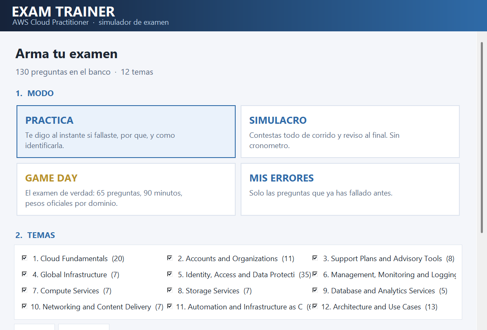
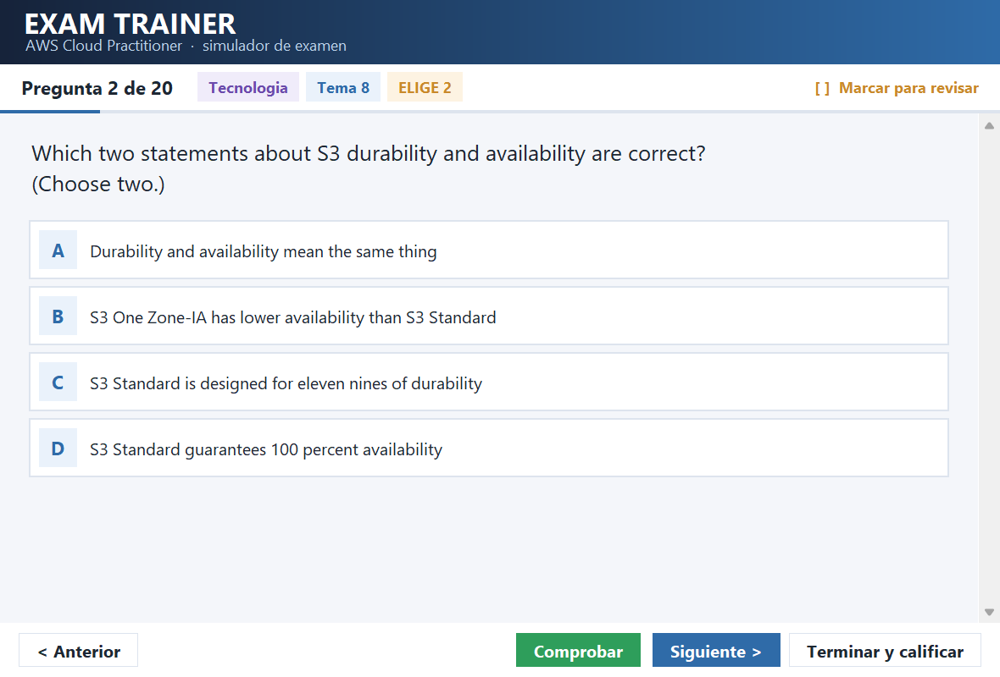
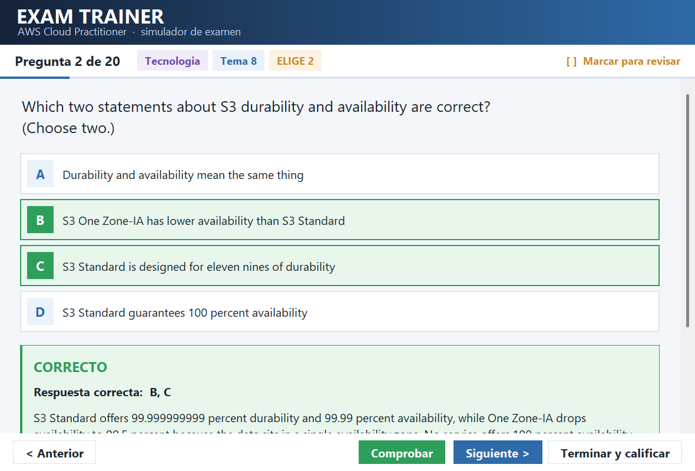
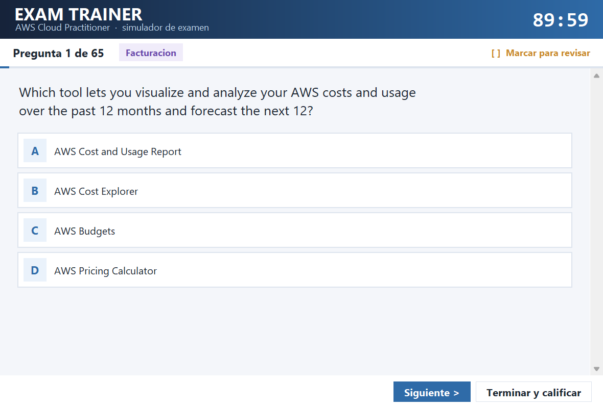
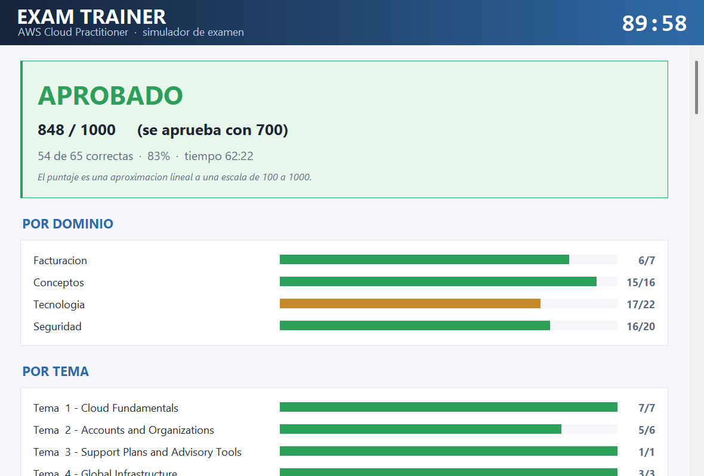
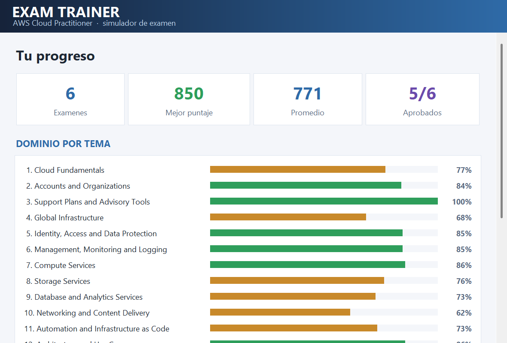

# Exam Trainer

Desktop application for practicing multiple-choice certification exams, written in
Python with **tkinter only** — no external dependencies.

The question bank is driven entirely by JSON files, so the same engine works for any
exam. The included sample set contains 130 original practice questions written for the
AWS Cloud Practitioner domains.

## Screenshots

| | |
|---|---|
|  |  |
| *Exam builder: mode, topics and question count* | *A multiple-answer question in practice mode* |
|  |  |
| *Instant feedback with explanation and hint* | *Game Day: timed, weighted by domain* |
|  |  |
| *Scaled score with breakdown by domain and topic* | *Progress across attempts* |

## Features

- **Four study modes**
  - *Practice* — immediate feedback with explanation and an identification hint
  - *Mock* — answer everything first, review at the end
  - *Game Day* — timed exam simulation with weighted domain distribution
  - *My mistakes* — replays only questions previously answered wrong
- Single and multiple answer questions, auto-detected from the `Choose N` wording
- Scaled scoring (100–1000) with a configurable pass threshold
- Persistent progress stored per user in `%APPDATA%`, including per-question history
- Statistics by exam domain and by topic
- Custom object-oriented widget components: scrollable containers, styled buttons,
  option rows, gradient-painted headers
- Packs into a single portable Windows executable with PyInstaller

## Running

```bash
python trainer.py
```

Python 3.9 or newer. Nothing to install.

## Building the executable

```bash
pip install pyinstaller
python build_exe.py
```

The result lands in `dist/ExamTrainer.exe` and bundles the `data/` folder.

## Adding your own questions

Drop JSON files into `data/variants/`. Every file is a list of question objects:

```json
{
  "id": "v-tec-001",
  "chapter": 7,
  "chapter_title": "Compute Services",
  "domain": "Cloud Technology and Services",
  "number": 1,
  "text": "Which service ... ?",
  "options": { "A": "...", "B": "...", "C": "...", "D": "..." },
  "answer": ["A"],
  "multi": false,
  "explanation_en": "Why A is correct and the others are not.",
  "tip": "How to recognize this question type under time pressure."
}
```

Optional extras:

- `data/bank.json` — a single base file loaded before the rest
- `data/tips/*.json` — a separate hint layer mapping `question id` to hint text,
  so hints can be maintained independently of the questions

Validate everything before shipping:

```bash
python tools/validate.py
```

It checks for duplicate ids, missing or invalid answer keys, options below the
minimum count, short explanations, missing hints, and `Choose N` wording that
disagrees with the number of correct answers.

## Domain weighting

`Game Day` mode samples questions according to the weights declared in `DOMAINS`
inside `trainer.py`. Change that list to match the blueprint of your own exam.

## License

MIT — see [LICENSE](LICENSE).

The bundled questions are original work written from public vendor documentation.
No content from any copyrighted study guide or official exam is included in this
repository.

## Disclaimer

This project is an independent study tool. It is not affiliated with, authorized
by, endorsed by, or sponsored by Amazon Web Services, Inc. or any certification
body. AWS and related marks are trademarks of Amazon.com, Inc. or its affiliates,
used here only to describe the subject matter of the sample question set.

